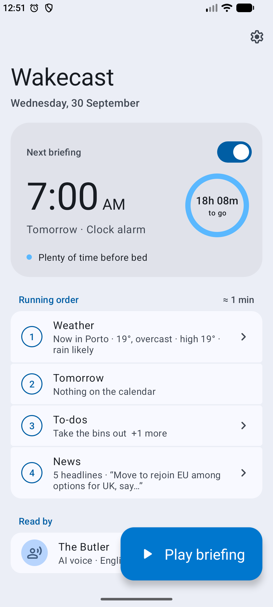
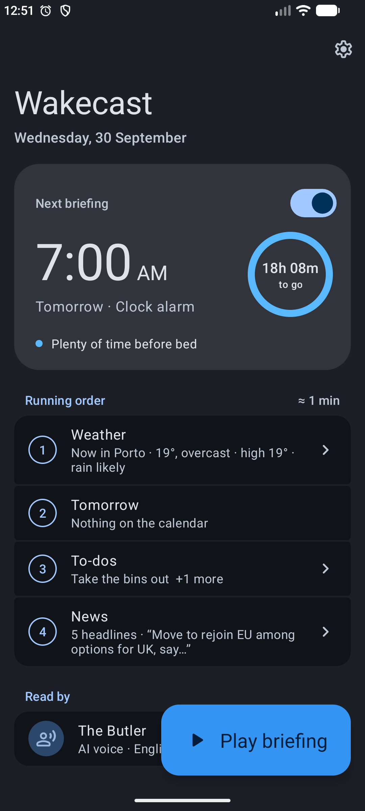
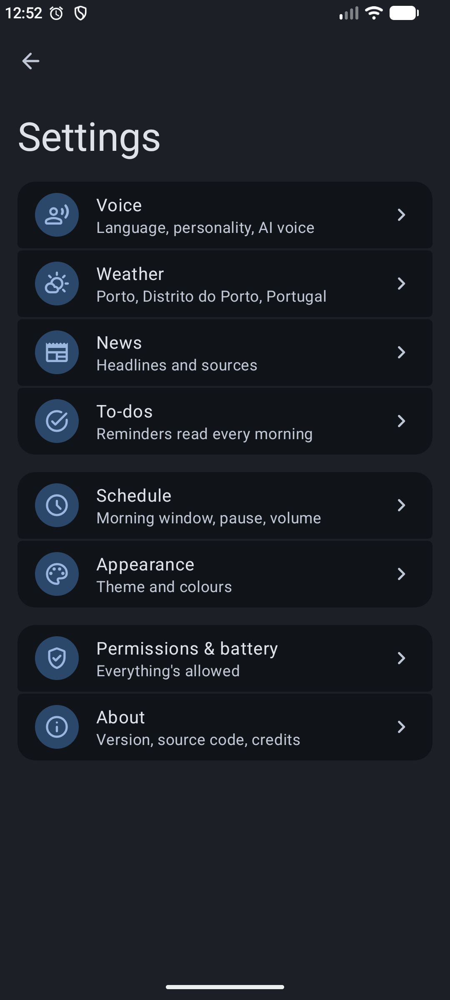
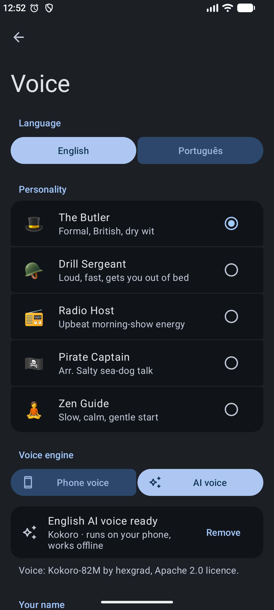
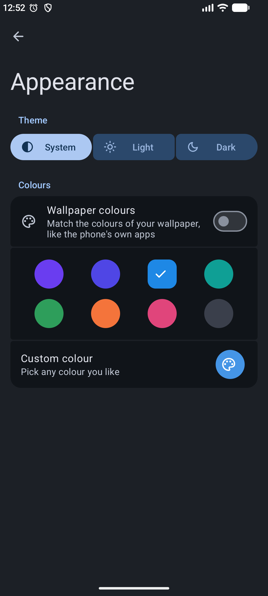
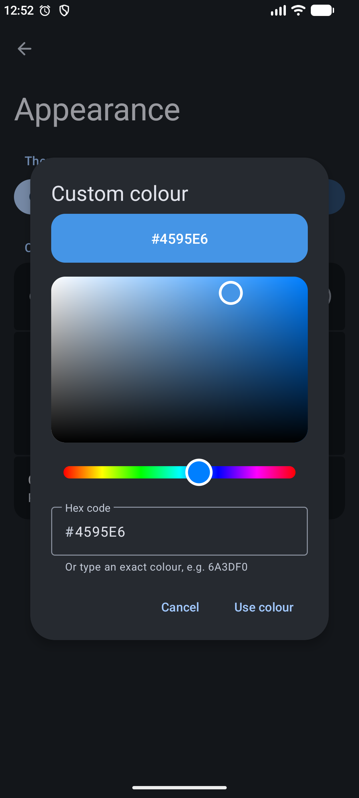

# Wakecast

Wakecast turns your morning alarm into a short spoken briefing. When you dismiss the alarm, it reads out the weather, what's on your calendar, your to-dos and the news, in the voice and personality you pick.

It's a small native Android app with no accounts, ads or tracking. Everything runs on your phone.

  
  

## What you hear

The home screen shows the briefing as a running order, with a preview of each part and roughly how long it will take.

1. Weather: current conditions, the high and low, when rain is likely to start, what to wear (umbrella, coat, sunscreen, wind) and sunset.
2. Your day: the day's events from every calendar on the phone, and how long you have until the first one.
3. To-dos: reminders you type into the app.
4. News: headlines from the sites you choose. Type a website such as `economist.com` and Wakecast finds its news feed and adds it as a source you can switch on or off. Touch and hold a source to delete it.

## Features

- Five personalities, each with its own wording for every line: The Butler, Drill Sergeant, Radio Host, Pirate Captain and Zen Guide.
- English and European Portuguese. A headline in the other language is read by that language's voice before it switches back.
- Two kinds of voice. The phone voice uses your phone's own text-to-speech. The AI voice is a free, optional download of natural neural voices (Kokoro for English, Piper "Dii" for Portuguese) that run on the phone and work offline.
- A sleep ring that shows how much sleep you'd get if you went to bed now, measured against 8 hours, with a short tip. It's blue above 12 hours, green from 8 to 12, yellow under 8 and red under 5.
- If you snooze, Wakecast waits for the next ring.
- Only alarms inside your morning window (for example 04:00 to 12:00) get a briefing, so nap alarms stay quiet.
- It looks like a built-in Android app, with Material 3 components, light and dark themes, and colours taken from your wallpaper. You can also pick one of eight colours, or any colour you like with the colour picker.

  
  
  
  

## Getting started

You need an Android phone running Android 8.0 or newer.

### 1. Install the app

1. On your phone, open the [latest release](../../releases/latest) and download `Wakecast.apk`.
2. Open the downloaded file. If Android asks, allow installing apps from the app you opened it with (Files, Chrome, Drive or similar).
3. If Play Protect warns that the app is unknown, tap **More details**, then **Install anyway**. Wakecast isn't on the Play Store, so Android shows this for any app installed this way.

Already have Wakecast 1.0? Install the new APK over it and your settings stay.

### 2. Finish setting up

Open Wakecast. While something is missing, the home screen shows a **Finish setting up** card. Tap it to open **Permissions & battery** and allow each item:

- Calendar, so it can read the day's events.
- Notifications, for the Play and Stop buttons while it talks.
- Alarms & reminders, so it starts right on time.
- Battery: unrestricted, so the phone doesn't close Wakecast overnight.
- City, needed for the weather.
- The voice for your language, if your phone's text-to-speech doesn't have it yet.

The card disappears once everything is allowed.

Many phones close apps overnight to save battery. If your briefing ever doesn't play, open **App info › Battery** for Wakecast and choose **Unrestricted** or allow background activity.

### 3. Make it yours

Tap the gear icon on the home screen to open Settings.

1. **Weather**: search for your city.
2. **Voice**: pick the language and a personality, and type your name if you'd like to be greeted by it. Use the sample button to hear how it sounds. For the AI voice, choose **AI voice** and let it download once.
3. **News**: choose how many headlines to hear and which sources to use, or add your own site.
4. **To-dos**: type the reminders you want read every morning, one per line.
5. **Schedule**: set your morning window and how long to pause after you dismiss the alarm before it starts talking.
6. **Appearance**: choose a light, dark or system theme and your colours.

Settings save as you change them.

### 4. Set an alarm and test it

Set an alarm in your usual clock app. Wakecast follows it automatically, and the home screen shows the time of the next briefing. To hear what tomorrow sounds like, tap **Play briefing**. Tap **Stop** to end it.

## How it knows you're awake

1. Android tells Wakecast whenever an alarm is added or changed in any clock app.
2. A minute before the alarm, Wakecast downloads the weather and news.
3. It waits while the alarm rings, which it detects through Android's audio system.
4. When you dismiss the alarm, it waits a few seconds and starts talking. A notification offers **Play now** and **Stop**.
5. If the alarm only vibrates, it starts when you unlock the phone.

## Privacy

Wakecast has no accounts, analytics or ads. It only goes online for the weather ([Open-Meteo](https://open-meteo.com), which needs no key), for the news feeds you choose, and for the one-time AI voice download. Your calendar events and to-dos never leave the phone, and the AI voices run on the phone, so nothing you hear is generated in the cloud.

## Build it yourself

1. Open the project in Android Studio (**File › Open**) and let Gradle sync.
2. Select the **app** run configuration and your device, then press **Run**.

To build an APK, use **Build › Build App Bundle(s) / APK(s) › Build APK(s)**. The file is saved in `app/build/outputs/apk/debug/`.

## Project layout

| File | What it does |
|---|---|
| `MainActivity` | Home: next briefing, sleep ring, running order, Play and Stop |
| `SettingsActivity` | Settings: voice, weather, news, to-dos, schedule, appearance, permissions, about |
| `BaseActivity`, `Ui` | Shared screen frame (colours, top app bar) and Material 3 building blocks |
| `ColourPicker` | The custom colour picker |
| `Setup` | What the app needs (permissions, city, voice) and how to fix each |
| `Scheduler`, `AlarmTriggerReceiver`, `SystemEventsReceiver`, `RescheduleJob` | Follow the phone's next alarm |
| `BriefingService` | Fetches data, waits for the alarm, speaks |
| `ScriptWriter` | Turns the data into each personality's script |
| `WeatherClient`, `AgendaReader`, `NewsClient`, `FeedFinder`, `Net` | Weather, calendar and news |
| `LanguageGuesser` | Tells English and Portuguese headlines apart |
| `DeviceVoice`, `DeviceSynth` | The phone's own voice |
| `AiVoice`, `VoiceDownloader`, `PcmPlayer`, `VoiceLeveler` | On-device AI voices: download, playback, loudness |
| `SleepGauge` | The sleep ring's colours and tips |
| `Prefs` | All settings |

## Credits

- Speech engine: [sherpa-onnx](https://github.com/k2-fsa/sherpa-onnx) (Apache 2.0)
- Voices, downloaded on demand: [Kokoro-82M](https://huggingface.co/hexgrad/Kokoro-82M) by hexgrad (Apache 2.0) and Piper "Dii" by OpenVoiceOS (CC BY-NC-SA 4.0, free for personal use)
- Weather: [Open-Meteo](https://open-meteo.com)
- Icons: [Material Symbols](https://fonts.google.com/icons) (Apache 2.0)
- UI components: [Material Components for Android](https://github.com/material-components/material-components-android) (Apache 2.0)
